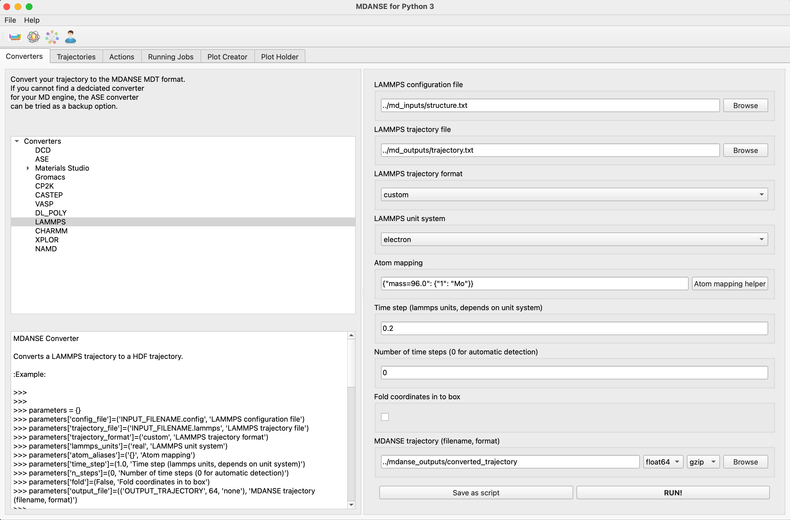
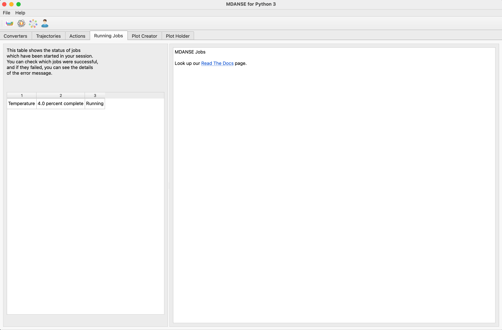
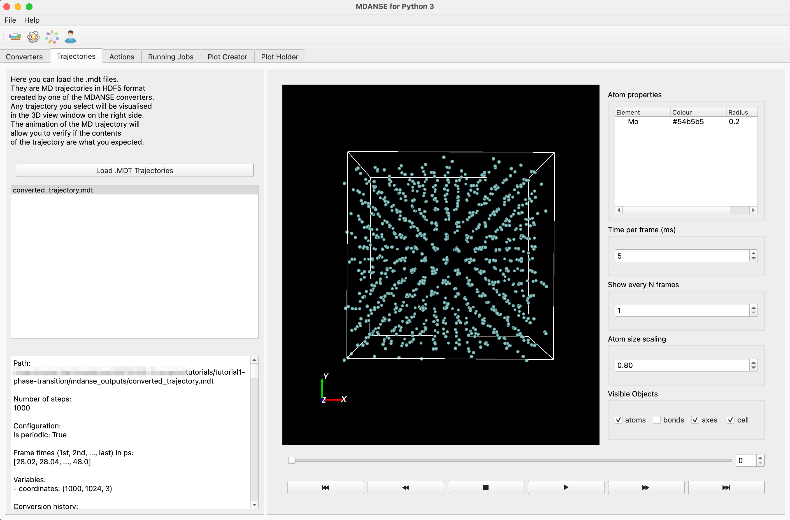
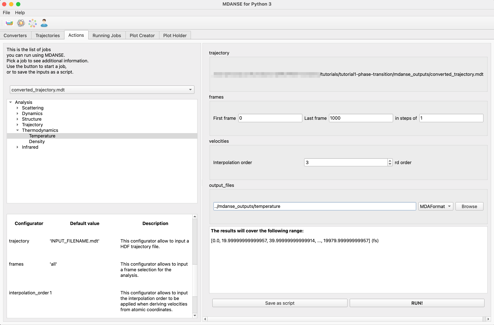
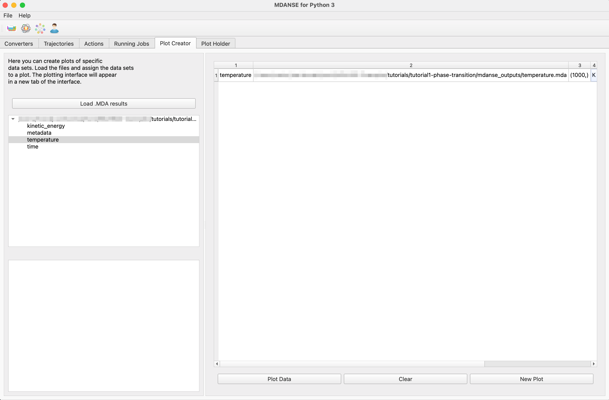
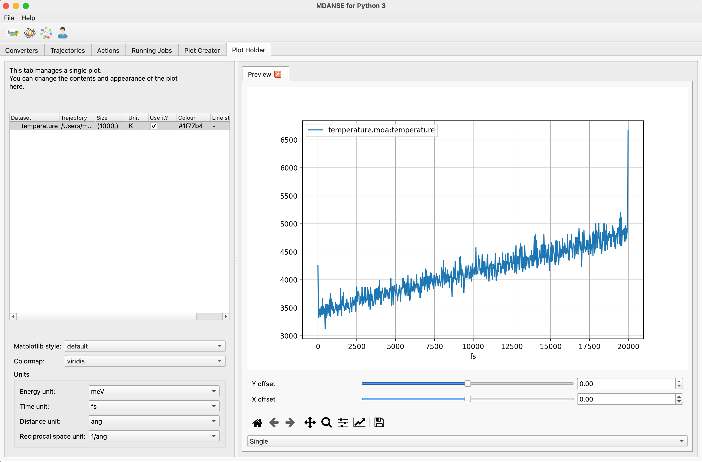
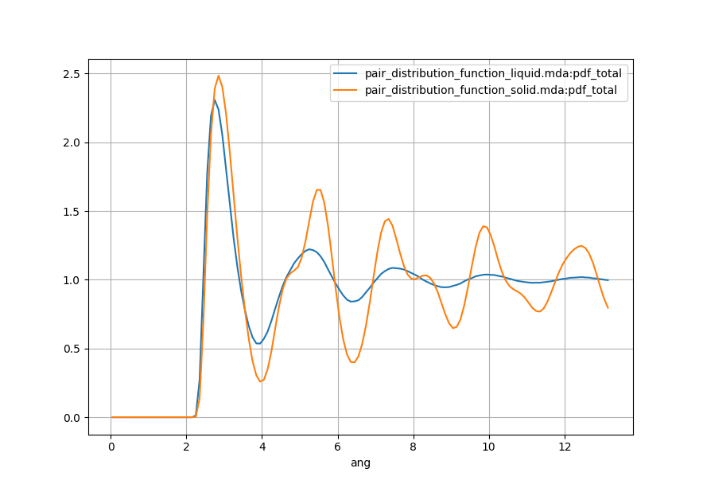

# MDANSE Tutorial: a phase transition

This tutorial will show you:
* how to convert a LAMMPS trajectory to the MDANSE format,
* how to run an analysis on the converted trajectory,
* how to plot the results of the analysis.

**Questions** will be asked in different sections
of this tutorial. The **answers** will be provided
at the end of the tutorial.

## Background

Most of the commonly taught thermodynamics and mechanical
statistics deals with equilibrium processes. That is,
the underlying assumption of most analysis types in MDANSE
is that the average quantities calculated for the simulated
system are constant.

In an MD simulation, the equilibrium state of the studied
system is not guaranteed. As the duration of a simulation
increases, it is possible that the simulated system
will undergo a transition to a qualitatively different state.
For this reason, it is important to verify the stability
of a trajectory.

## Scenario of this tutorial

We will analyse a trajectory of metallic molybdenum. This
trajectory is blatantly not equilibrated, as the thermostat
used here was set to introduce a temperature ramp.

# Files

This tutorial contains the following files:

## md_inputs
These are the input files needed to re-run the MD simulation:
* structure.txt - a LAMMPS structure file
* molybdenum_script.lmp - a LAMMPS script 
* Mo5.2.mgpt.potin - a LAMMPS potential file
* Mo5.2.mgpt.parmin - a LAMMPS potential file

## md_outputs
These are the _cropped_ output files:
* trajectory.txt - a LAMMPS custom format trajectory
* simulation_log.txt - part of LAMMPS log output (thermostat)

The actual simulation was longer than this, but only one
section of the output is used in this tutorial, allowing
us to save both time and storage space.

## mdanse_inputs
These are the scripts that, when run from the mdanse_inputs
directory, will produce the outputs of the mdanse runs
described in this tutorial.
* script1_conversion.py - produces the MDANSE-format trajectory.
* script2_temperature.py - calculates the temperature of the simulated system.
* script3_rmsd.py - calculates the root mean square displacement of atoms.
* script4_pdf - calculates the pair distribution function of atoms.

## mdanse_outputs
All the files created by MDANSE will be written here.
Also, for people who don't use the GUI, there is a brief comment on
how 'TextFormat' can replace 'MDAFormat' in the scripts to
create plain text output of analysis. Please read:
* about_outputs.txt

for more detail

# The actual tutorial, step by step.

In the text of the tutorial, we will be concentrate on the
MDANSE GUI. However, the conversion and analysis jobs can
be run also without the GUI. The scripts for running all
the parts of the tutorial are provided in md_inputs/script*

## Convert the trajectory

MDANSE likes to reduce the overhead of parsing the input files
by converting each trajectory to a binary HDF5 format once,
and then using this trajectory as input for all the analysis types.

The trajectory in this example has been created using LAMMPS.
The LAMMPS script which produced this trajectory is available
in md_inputs/molybdenum_script.lmp and you will need to open it
to find some information needed to convert the trajectory
correctly.

Most importantly, LAMMPS offers different unit systems,
and the converter needs to be informed about the unit system
used in the simulation, since the trajectory file does not
contain this information. Here we used the 
[MGPT](https://docs.lammps.org/pair_mgpt.html) potential,
which required us to use the *electron* unit system. Another
crucial detail is the size of the simulation time step.
You can also find it in the LAMMPS script (and it set to 0.2).

Go to the 'Converters' tab in the GUI, and pick the LAMMPS
converter. Now you have to pass the correct inputs to the
converter.

The LAMMPS configuration file is
'md_inputs/structure.txt', and the LAMMPS trajectory file
is 'md_outputs/trajectory.txt'. Change the LAMMPS unit system
to 'electron' and time step to '0.2', since these are the
values you found in the LAMMPS script of this simulation.
Once you have picked the correct units and time step,
choose the location of the output file. We are using a generic
name 'mdanse_outputs/converted_trajectory.mdt'.
If some of the fields are not filled out correctly, the
GUI will try to make it clear
by disabling the 'RUN!' button and highlighting the
wrong entries.

Run the conversion
by pressing the 'RUN!' button in the bottom-right corner.
You can now see a new entry in the 'Running Jobs' tab,
showing the progress of the conversion.

For the moment we are going through all the steps
using the MDANSE_GUI. However, you can also get the same
result using a Python script.
A script which will run the conversion and save the output
as 'mdanse_outputs/converted_trajectory.mdt' is located in
'mdanse_inputs/script1_conversion.py'. Since it uses
relative paths to files, you will have to run it
from mdanse_inputs as the working directory.

## Load the trajectory

Go to the 'Trajectories' tab and load the trajectory created
by the converter in the previous step. You should see the first
frame of the trajectory in the 3D viewer. Also, basic information
about the trajectory will be displayed in the bottom-left
text box.

You can watch the animation of the trajectory, just to see if
anything unexpected happened in your system during the run.
Since this is a metallic system, it makes sense to disable
the 'bonds' option of the visualiser. Press the 'play' button
to start the animation. (If you don't have the patience to watch
every single frame, you can press 'fast forward' instead.)

**Question**: What is the difference between the structures
in the beginning and at the end of the simulation?

## Calculate the temperature of the system

Normally, the temperature of the system can be derived
from the kinetic energy of the atoms. It is sufficient
to know the masses of atoms and their velocities at each
step. If the information about the velocities is not
stored in the trajectory file, MDANSE can reconstruct this
information by interpolating the atomic positions of subsequent
simulation frames.

We assume that you have already loaded the trajectory into
the GUI. (If not, go back to the previous step.)
In the Actions tab, find the analysis called "Temperature".
It is located in 'Analysis -> Thermodynamics -> Temperature'.

You can pick the interpolation
order used for the determination of velocities. In the script
'mdanse_inputs/script2_temperature.py' we are using the
3rd order interpolation. Run the analysis, saving the output
in 'mdanse_outputs/temperature.mda'

You can plot the calculated temperature by going to the
'Plot Creator' tab.

Load the analysis result using the
'Load .MDA results' button. Now, unfold the contents
tree in the data view below, and click on the 'temperature'
dataset. It will appear in the box on the right.
Since we only have one curve to plot, you can just click
the 'Plot Data' button. The curve will be plotted in
the current plot in the 'Plot Holder' tab.

Go to the 'Plot Holder' tab and have a look at the results.
Most likely the first and last values of the temperature
will be significantly different to the other points. This
is to be expected, since interpolation will not be accurate
when there are no values to interpolate between on one side
of the data point.

Now, open the simulation log 'md_outputs/simulation_log.txt'
in any text editor, and check the temperature values logged there.
The temperature values in the log file were calculated by
the MD engine based on the velocity values at those specific
simulation steps.

**Question**: The MDANSE temperature values don't match
the values in the log. Why?

## Calculate the Root Mean Square Displacement of atoms

Same as in the previous part of the tutorial,
make sure that the trajectory has been loaded into the GUI.

In the Actions tab, go to
'Analysis -> Structure -> RootMeanSquareDeviation'.
The default values of the input fields should work well
in this example; the only thing that needs to be set
is the output filename. In the script we used
the destination 'mdanse_outputs/root_mean_square_displacement.mda'.

Again, you can observe the progress of the analysis in the
'Running Jobs' tab. Once the calculation has finished,
go to the 'Plot Creator' tab. On the right side, 'Clear'
the table of data and create a 'New Plot'. Then, load the
output file you just created, and select the dataset
'rmsd_all'. On the right, click 'Plot Data' and go
to the Plot Holder tab. You will see the calculated
root mean square displacement of atoms from the
reference position (which in our analysis was
the initial position).

**Question**: Based on this plot, the system has
melted in the second half of the simulation.
At what temperature did the melting occur?

## Calculate the Pair Distribution Function

The result in the previous step showed us that the
first and second halves of the simulation are
qualitatively different. Now we will use this
information to specify limits for the next analysis.

In the Actions tab, choose
'Analysis -> Structure -> Pair Distribution Function'.
Instead of using the default values of simulation frames,
we will now limit the time range used for the calculation.
Set 'frames' to be 0, 200, 1, and then pick a name for
the output file ('../mdanse_outputs/pair_distribution_function_solid.mda'),
then run the analysis. Before moving to another tab, you can
set frames to 700, 900, 1, change the output file name to
'../mdanse_outputs/pair_distribution_function_liquid.mda',
and click 'RUN!' again. (The script that will do the same thing
for you outside of the GUI 'script4_pdf.py')

In the Plot Creator tab click 'Clear', 'New Plot', and load
both the output files you just created. Add 'pdf_total'
data set from each of the two files to the plot and click
'Plot Data'. In the Plot Holder tab you should now
see a plot like this one:

The plot shows that the interatomic distances in the
liquid molybdenum are more evenly spread compared to
the solid. However, the coordination spheres can still
be seen which correspond to the preferred interatomic
distance.

# Discussion of the results

## Question 1:

By now it is quite clear that the system in the simulation
started off as a solid, and ended up being a liquid.

## Question 2:

The answer to this problem is in the trajectory sampling
chosen in the LAMMPS script. In this run, LAMMPS was writing
out the positions only every 100 steps, which means that
20 fs of the simulation time would pass between each two
consecutive writeouts. This makes it unlikely that the
reconstruction of the velocities based on the atom positions
could ever succeed.

While it is common practice not to write out every single
simulation step, please be keep in mind that not all the
properties can be accurately reproduced based on the
incomplete trajectory sampling. In the case of the
temperature here, we can simply rely on the simulation
logs.

## Question 3:

Based on the simulation logs, the melting temperature
of molybdenum in this simulation was close to 4200-4300 K.
This is not particularly close to the real-life value of the
molybdenum melting point (which is ca. 2900 K.)

While ultimately it is the force field used in the simulation
that defines what properties can be accurately reproduced,
it is important to remember that a typical MD simulation
is rather short compared to the time scale of real-life
phenomena. Looking at the LAMMPS script for this simulation,
you will notice that the temperature ramp was going
from 2000 to 8000 K within 80 ps. This is an extremely fast
heating rate, and is likely to result in a superheated
system. This is, of course, not a problem that MDANSE
should be dealing with. We just like to remind the users
to be aware of the limitations of the methods they are using.

