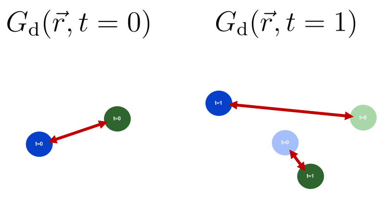
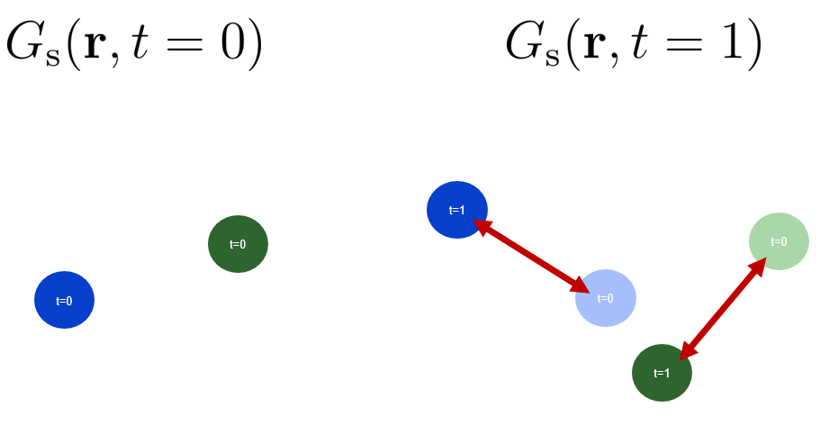
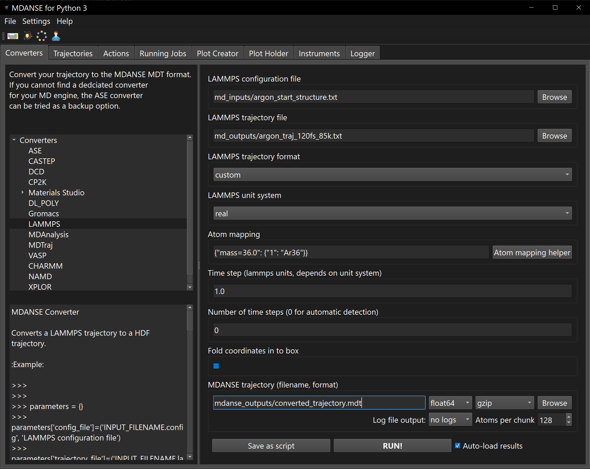
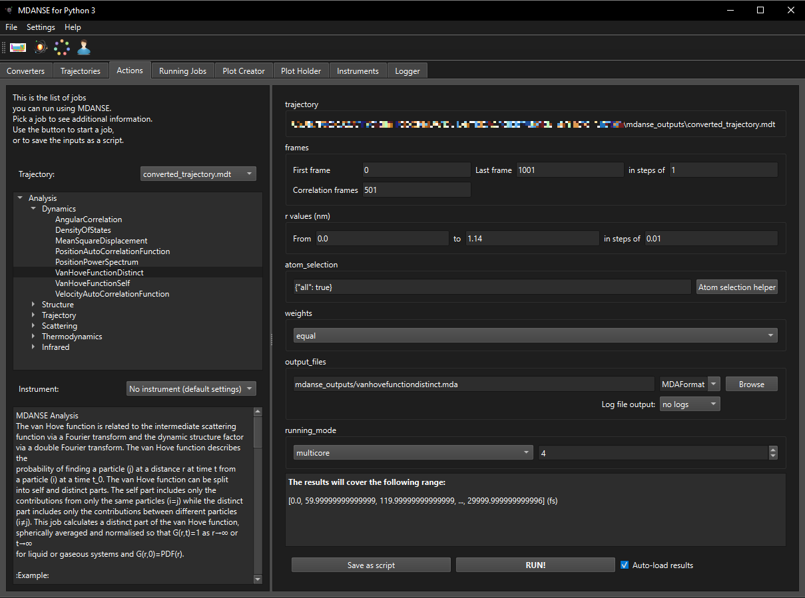
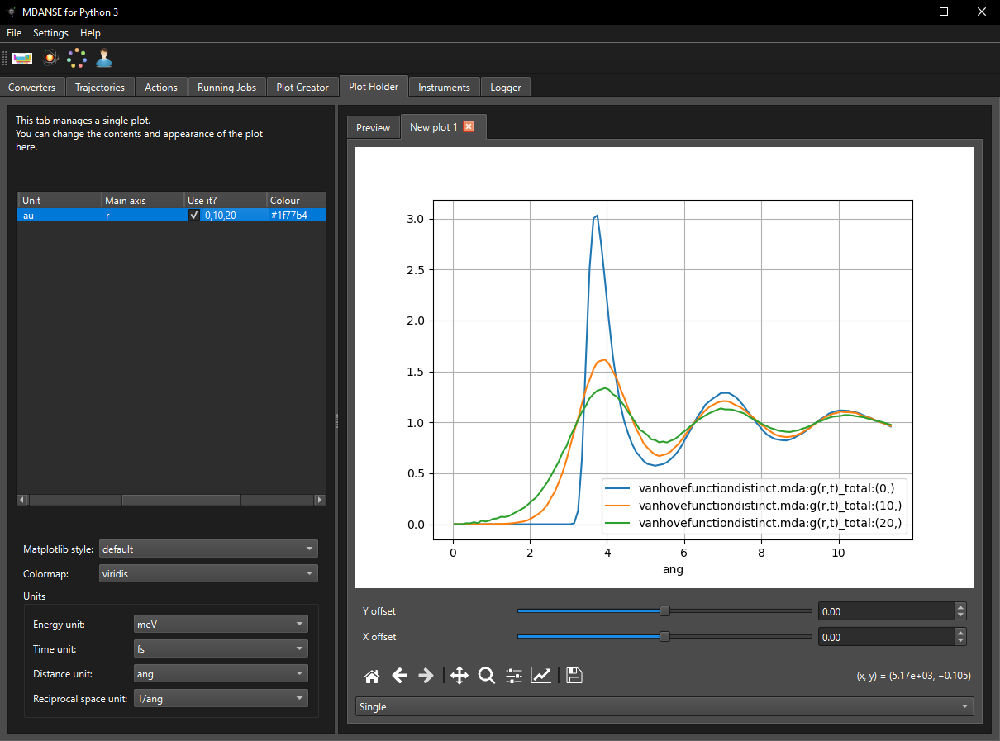

# MDANSE Tutorial 2: The van Hove functions

This tutorial will show you:
* how to run an analysis related to the van Hove functions,
* how to plot the results of the analysis

**Questions** will be asked in different sections
of this tutorial. The **answers** will be provided
at the end of the tutorial.

## Background

### Pair distribution function
The pair distribution function (PDF) provides us with some information about 
how atoms are distributed in the system. It tells us what the average 
number of particles will be at a distance $\mathbold{r}$ in volume 
$\mathrm{d}\mathbold{r}$ from an atom.

```math
n_0 g(\mathbold{r}) \mathrm{d}\mathbold{r} = \mathrm{d}N(\mathbold{r})
```

Here $n_0$ is the bulk density, $g(\mathbold{r})$ is the PDF and 
$\mathrm{d}N(\mathbold{r})$ is the average number of particles in the 
volume $\mathrm{d}\mathbold{r}$. The PDF is can be written so that it is a 
function of the distance atoms. In this case the pair distribution 
function tells us the average number of particles in the shell volume 
$4 \pi r^2 \mathrm{d}r$ from a distance $r$ of an atom.

```math
n_0 g(r) 4 \pi r^2 \mathrm{d}r = \mathrm{d}N(r)
```

Now the PDF $g(r)$ is a function of distance and 
$\mathrm{d}N(r)$ is the average number of particles in the shell volume 
$\mathrm{d}\mathbold{r}$. The PDF can be written as a sum of delta 
functions. 

```math
n_0 g(r) = \frac{1}{4 \pi r^2} \frac{1}{N} \sum_{k \neq j} \langle \delta (r - \vert \mathbold{r}_k - \mathbold{r}_j \vert) \rangle
```

**Question 1**: Try to derive this equation. Think about what $N(r)$ is 
and therefore what $\mathrm{d}N(r) = N(r + \mathrm{d}r) - N(r)$ should be.

For more details on running PDF calculations with MDANSE 
see **MDANSE Tutorial 1: a phase transition**.

### The van Hove function

```math
n_0 g(\mathbold{r}) = \frac{1}{N} \sum_{k \neq j} \langle \delta (\mathbold{r} - \mathbold{r}_k - \mathbold{r}_j) \rangle
```

Is the PDF as a function of $\mathbold{r}$, the van Hove function is closely 
related and is also a sum of delta functions.

```math
G(\mathbold{r}, t) = \frac{1}{N} \sum_{k j} \langle \delta (\mathbold{r} - \mathbold{r}_k(t) - \mathbold{r}_j(0)) \rangle
```

The PDF gives use some insights into the structure of our system while 
the van Hove function gives us insights into the structure and dynamics 
of the system. The van Hove function can be split into self and distinct 
parts.

```math
G_{\mathrm{s}}(\mathbold{r}, t) = \frac{1}{N} \sum_{j} \langle \delta (\mathbold{r} - \mathbold{r}_j(t) - \mathbold{r}_j(0)) \rangle \\
G_{\mathrm{d}}(\mathbold{r}, t) = \frac{1}{N} \sum_{k \neq j} \langle \delta (\mathbold{r} - \mathbold{r}_k(t) - \mathbold{r}_j(0)) \rangle
```

At $t=0$ the distinct-part of the van Hove function is the PDF 
$G_{\mathrm{d}}(\mathbold{r}, 0) = n_0 g(\mathbold{r})$. At other times
the distinct-part of the van Hove function describes distance between 
atom at different times.



The above figure shows the distances (red arrows) that the distinct-part 
of the van Hove function depends on. At $t=0$ the van Hove function is simply 
the PDF. After a some time the blue and green atoms move 
some distance, the distinct-part of the van Hove function depends on the 
distances between atoms at $t=0$ and $t=1$.



The self-part of the van Hove function is closely related to the 
diffusion of a particle. The above figure shows the distances (red arrows) 
that the self-part of the van Hove function depends on. At $t=0$ there 
are no arrows since the distance of at atom with itself is zero so that 
the van Hove function is a delta function 
$G_{\mathrm{s}}(\mathbold{r}, 0) = \delta(\mathbold{r})$. At $t \neq 0$ the 
self-part of the van Hove function depends on distances between atoms 
with itself at different times.

## Scenario of this tutorial

We will analyse a trajectory of liquid argon using the self and 
distinct-parts of the van Hove functions and see how they change as a 
function of time.

# Files

This tutorial contains the following files:

## md_inputs
These are the input files needed to re-run the MD simulation:
* argon_start_structure.txt - a LAMMPS structure file
* argon.lmp - a LAMMPS script

## md_outputs
These are the LAMMPS files:
* argon_traj_120fs_85k.txt - a LAMMPS custom format trajectory

## mdanse_inputs

## mdanse_outputs
All the files created by MDANSE will be written here.

# The actual tutorial, step by step.
In the text of the tutorial, we will concentrate on the
MDANSE GUI. However, the conversion and analysis jobs can
be run also without the GUI. The scripts for running all
the parts of the tutorial are provided in `md_inputs/script*`.

## Convert and load the trajectory
The trajectory in this example has been created using LAMMPS.
The LAMMPS script which produced this trajectory is available
in `md_inputs/argon.lmp` and you will need to open it
to find some information needed to convert the trajectory
correctly.

Go to the 'Converters' tab in the GUI, and pick the LAMMPS
converter. Now you have to pass the correct inputs to the
converter. The LAMMPS configuration file is
`md_inputs/argon_start_structure.txt`, and the LAMMPS trajectory file
is `md_outputs/argon_traj_120fs_85k.txt`. Change the LAMMPS time step to '2',
since this is the value found in the LAMMPS script for this simulation. Use 
the generic output filename `mdanse_outputs/converted_trajectory.mdt`.



## Calculate the distinct-part of the van Hove function
Select the VanHoveFunctionDistinct job leaving the setting to the 
defaults. To speed the calculation up you may want to switch the 
running mode to multicore and the number of processes to a number 
greater than 1. Set the outputs file to saving the output
to `mdanse_outputs/vanhovefunctiondistinct.mda`, hit run and wait 
for the job to complete, you check the running jobs tab to check the 
progress of the job.



Once complete the results would load up automatically. Go to the 
plot creator and plot the `g(r,t)_total` result. Go to the plot holder 
and in the dataset table set the `g(r,t)_total` to have a main axis for 
`r` and the Use it? setting to `0,10,20`.



Note that in MDANSE the van Hove function is spherically averaged and is 
divided by $n_0$. This means that for liquid and gas system, 
the van Hove function tends towards 1 for large values of $r$. We can see that 
time advances, the van Hove function begins to flatten and the 
correlation hole around each atom begins to fill up. The correlation hole 
is absence of atoms that exists around each atom due to the short-range 
repulsive effects for the atoms on each other. On the PDF this is the 
part at short distances that are zero. As time progresses the atoms move 
and this allows other atoms to move into the hole.

**Question 2**: We know that at $t=0$ that the distinct-part of the van 
Hove function is the PDF. What does the van Hove function become as 
$t \rightarrow \infty$ for solid, liquid and gaseous systems?

## Calculate the self-part of the van Hove function
Select the VanHoveFunctionSelf job leaving the setting to the 
except for the correlation frames which we will set to 31. This will 
mean that there will have 31 time steps of the correlation function, the 
number configurations each time step of the correlation function will be 
971 = 1001 - 30 + 1. Set the outputs file to saving the output to 
`mdanse_outputs/vanhovefunctionself.mda` and hit run. 

Go to the plot 
creator and plot the `g(r,t)_total` result. Go to the plot holder and in 
the dataset table set the `g(r,t)_total` to have a main axis for `r`. 
Notice that for $t=0$ you get one large value near zero, remember that at 
$t=0$ the self-part of the van Hove function is a delta function. Set 
the main axis to `r` and Use it? setting to `10,20,30`. You may need to 
zoom in for the plots towards the smaller distances.


Similarly to the distinct-part, the self-part of the van Hove function 
is spherically averaged and is divided by $n_0$.
We can see from the above plots the distributions of the atoms from its 
initial position at 10, 20 and 30 time steps from $t=0$. The self-part 
of the van Hove function is closely related to the diffusion of an atom.

**Question 3**: What does the self-part of the van Hove function become as 
$t \rightarrow \infty$ for solid, liquid and gaseous systems?


## Question 1:

```math
n_0 g(\mathbold{r}) 4 \pi r^2 \mathrm{d}r = \mathrm{d}N(r)
```

The function $N(r)$ is a sum of step functions so that $N(r)$
increases by one as $r$ increases each time it comes across an atom on average. 
Therefore, $\mathrm{d}N(r) = N(r + \mathrm{d}r) - N(r)$ and $\mathrm{d}N(r)$ will be the 
average number of particles in the shell volume. The derivative of $N(r)$ will be 
the derivative of the step functions which are delta functions each 
centered on the distances away to another atom.

```math
\frac{\mathrm{d}N(r)}{\mathrm{d}r} = \frac{1}{N} \sum_{k \neq j} \langle \delta (r - \vert \mathbold{r}_k - \mathbold{r}_j \vert) \rangle
```

Where we have written the sum of delta functions inside $\langle \cdot \rangle$ 
so that the positions are thermally averaged and average the thermal average
over all possible atom origins.

## Question 2:

For a solid systems atoms are fixed in specific sites so the 
distinct part of the van Hove function does not change much. So as 
$t \rightarrow \infty$ the van Hove function is more or less the same 
as it is for any other time. For liquid and gaseous system the situation 
is quite different since atoms are free to move across the system, so that
$\lim_{t \rightarrow \infty} G_{\mathrm{d}}(\mathbf{r}, t) = n_0$ or $1$ in MDANSE 
since it has been normalized. In other words this results tell us that 
there is no correlation between the configurations at $t=0$ and $t = \infty$.


## Question 3:

For a solid each atom will be fixed at specific sites. They oscillate 
around those sites so the self-part of the van Hove function for long 
times will be a function which described the probability of the atom 
around the center of its site. For liquid and gaseous system all atoms 
are free diffuse move across the entire system. For 
$\lim_{t \rightarrow \infty} G_{\mathrm{s}}(\mathbf{r}, t) = V^-1$ or $N^-1$ 
in MDANSE since it has been normalized.