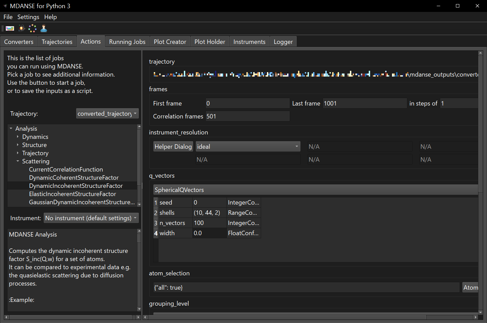
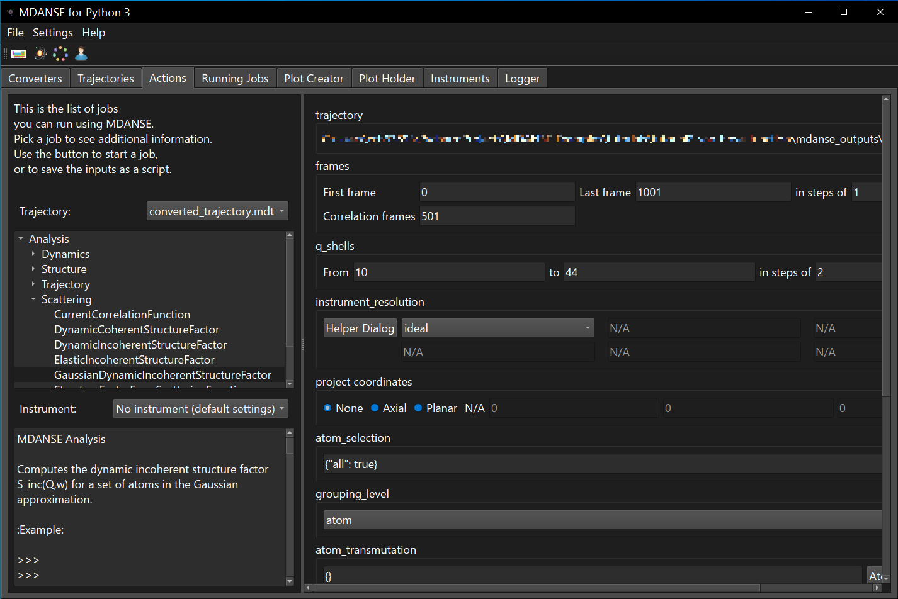
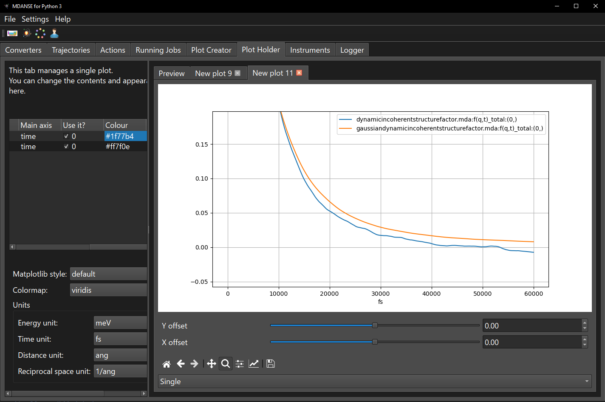
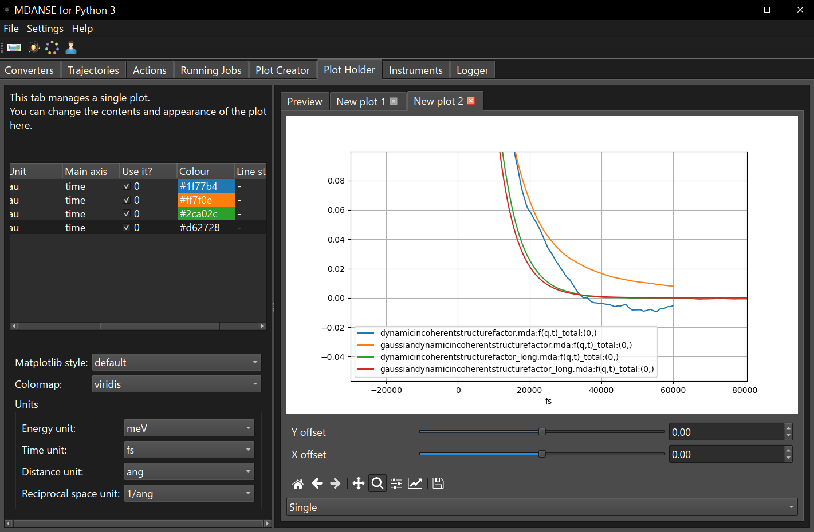
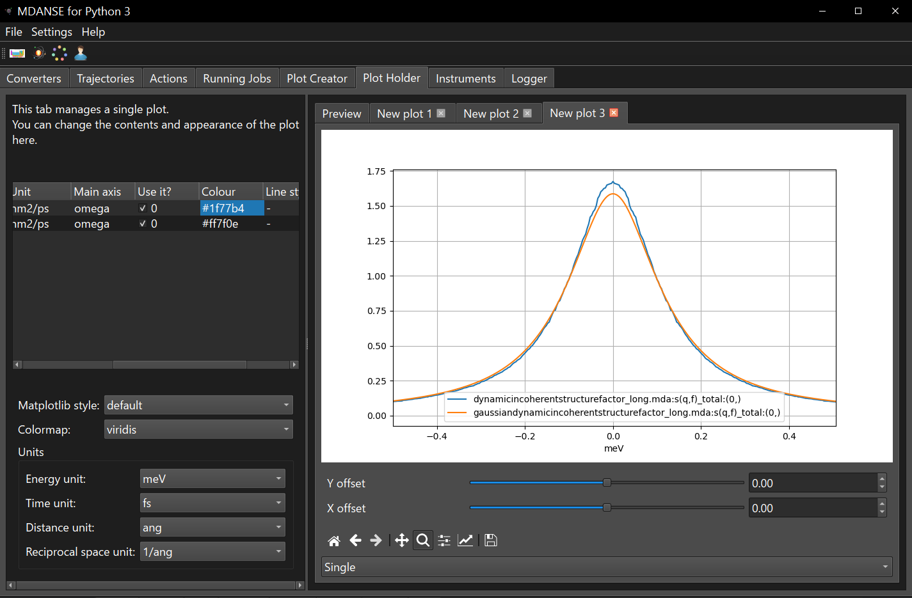
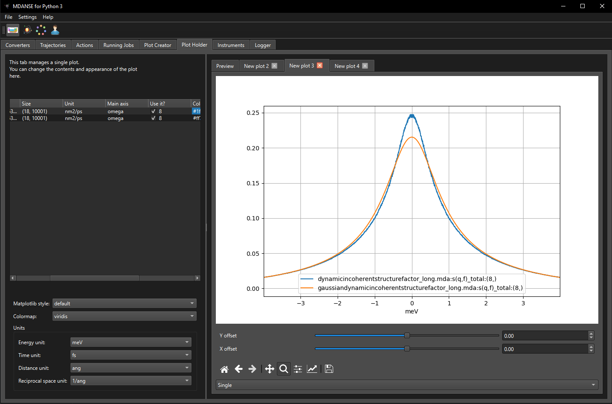
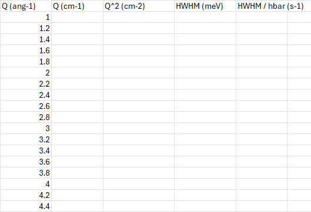
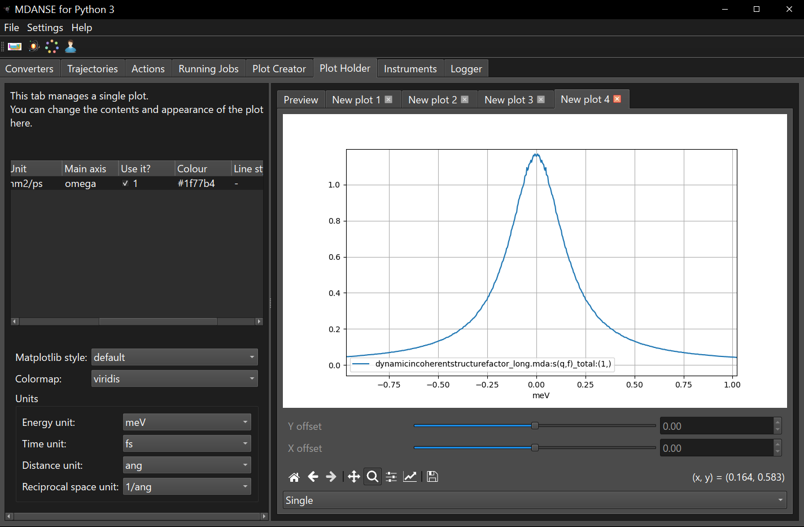
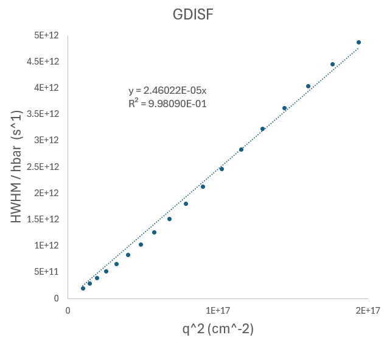
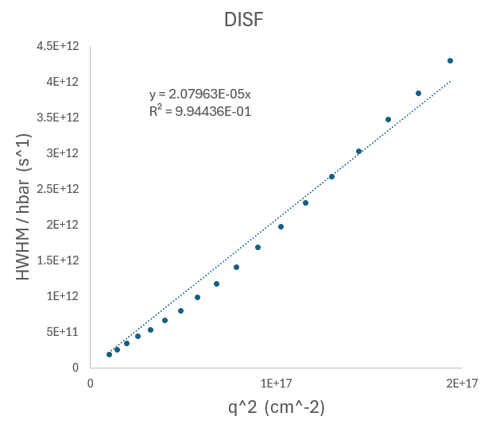

# MDANSE Tutorial 3: Quasielastic neutron scattering (QENS)

This tutorial will show you:
* how to run an analysis related to the QENS experiements,
* how to plot the results of the analysis

**Questions** will be asked in different sections
of this tutorial. The **answers** will be provided
at the end of the tutorial. We recommend completing 
**MDANSE Tutorial 2: the van Hove functions** before starting this one.

## Background

Quasielastic scattering is a special case of inelastic scattering with low
energy transfer and leads to a broad peak around $\omega = 0$. Incoherent 
QENS can be used to study diffusion and other similar processes. To understand 
how QENS is related to the diffusion of a particle we can start from the 
self-part of the van Hove function (see **MDANSE Tutorial 2: the van Hove functions**).

The dynamic incoherent structure factor (DISF) can be accessed from neutron scattering 
experiments and is related to the van Hove function via Fourier transforms
```math
G_{\mathrm{s}}(\vec{r}, t) = \frac{1}{N} \sum_{j} \langle \delta (\vec{r} - \vec{r}_j(t) - \vec{r}_j(0)) \rangle
```
```math
F_{\mathrm{inc}}(\vec{q}, t) = \int \mathrm{d}\vec{r} \, G_{\mathrm{s}}(\vec{r}, t) \exp(-i\vec{q} \cdot \vec{r})
```
```math
S_{\mathrm{inc}}(\vec{q}, \omega) = \frac{1}{2 \pi}\int \mathrm{d}\omega \, F_{\mathrm{inc}}(\vec{q}, t) \exp(i \omega t)
```
where $G_{\mathrm{s}}(\vec{r}, t)$ is the self-part of the van Hove function which 
describes the probability of a particle at a time $t$ from its initial position 
at time $0$. $F_{\mathrm{inc}}(\vec{q}, t)$ is the incoherent intermediate scattering 
function, $S_{\mathrm{inc}}(\vec{q}, \omega)$ is the DISF and 
$\vec{q}$ and $\omega$ are the momentum and energy changes of the 
neutron after the scattering event respectively. If a neutron 
has an initial and final momentum of $\vec{k_{\mathrm{i}}}$ and $\vec{k_{\mathrm{f}}}$ 
with an initial and final energy of $E_{\mathrm{i}}$ and $E_{\mathrm{f}}$
then
```math
\vec{q} = \vec{k}_{\mathrm{i}} - \vec{k}_{\mathrm{f}}
```
and
```math
\hbar \omega = E_{\mathrm{i}} - E_{\mathrm{f}}.
```

There are a number of ways to show how the DISF is related to the 
diffusion constant of a particle. We will start by rewriting the incoherent 
intermediate scattering function so that it is an exponential 
of the cumulants of $d_{j}(t) = \hat{q} \cdot \[\vec{r_{j}}(t) - \vec{r_{j}}(0)\]$ 
which is the displacement of atom $j$ along the unit vector ($\hat{q}$) of $\vec{q}$.
```math
F_{\mathrm{inc}}(\vec{q}, t) = \frac{1}{N} \sum_{j} \exp \left[-\frac{q^2}{2} \langle d^{2}_{j}(t) \rangle + \cdots \right]
```
The Gaussian approximation is obtained by taking only the leading term of the 
exponent, where $\langle d_{j}^{2}(t) \rangle$ which is the 2nd moment 
of $d_{j}(t)$. This approximation is exact for a system which undergoes Fickian diffusion 
(normal diffusion) so that for an isotropic monoatomic system
```math
\langle d^{2}_{j}(t) \rangle = \mathrm{MSD}(t) / 3 = 2 D \vert t \vert
```
where $D$ is diffusion constant and the intermediate scattering 
function with the Gaussian approximation will be 
```math
F_{\mathrm{inc}}(\vec{q}, t) = \exp(- D q^2 \vert t \vert ).
```
By Fourier transforming this intermediate scattering function we can obtain 
expression of the van Hove function and the DISF in terms of the diffusion 
constant
```math
G_{\mathrm{s}}(\vec{r}, t) = \left( \frac{1}{4 \pi D \vert t \vert} \right)^{3/2} \exp\left( - \frac{r^2}{4 D \vert t \vert} \right)
```
and
```math
S_{\mathrm{inc}}(\vec{q}, t) = \frac{1}{\pi} \frac{\hbar \Gamma(q) }{(\hbar \omega)^2 + (\hbar \Gamma(q))^2}
```
here $S_{\mathrm{inc}}(\vec{q}, t)$ is a Lorentzian function with a 
half-width at half maximum of $\hbar \Gamma(q)$ where $\Gamma(q) = D q^2$.
The diffusion constant can be obtained from a QENS experiment by measuring 
$\hbar \Gamma(q)$ of the QENS peak as a function of $q^2$.

**Question 1**: Some other examples where the Gaussian approximation is 
exact include the ideal gas, harmonic oscillator and the Debye lattice. For the 
ideal gas (free particles) what is $\langle d^{2}_{j}(t) \rangle$ for this 
system given that the particles velocities are distributed following the 
Maxwell-Boltzmann distribution? Finally, what is the van Hove function, the 
intermediate scattering function and dynamic structure factor for this system? 


## Scenario of this tutorial

First we will have a look at the differences in the scattering functions 
and dynamic structure factors when the Gaussian approximation is applied 
for a liquid argon system. Will we then determine the diffusion constant 
from the QENS peaks simulated from the DISF and GDISF calculations.

# Files

This tutorial contains the following files:

## mdanse_inputs
These are the scripts that, when run from the mdanse_inputs
directory, will produce the outputs of the mdanse runs
described in this tutorial.
* script1_conversion.py - produces the MDANSE-format trajectory from the lammps trajectory files in tutorial 2.
* script2_disf.py - calculates the dynamic incoherent structure factor of the simulated system.
* script3_gdisf.py - calculates the Gaussian dynamic incoherent structure factor of the simulated system.

## mdanse_outputs
All the files created by MDANSE will be written here. We included some 
precalculated results using a longer Argon trajectory.
* dynamicincoherentstructurefactor_long.mda - DISF of an Argon trajectory.
* gaussiandynamicincoherentstructurefactor_long.mda - GDISF of an Argon trajectory.
* meansquareddisplacement_long.mda - MSD of an Argon trajectory.

# The actual tutorial, step by step.
In the text of the tutorial, we will concentrate on the
MDANSE GUI. However, the conversion and analysis jobs can
be run also without the GUI. The scripts for running all
the parts of the tutorial are provided in `md_inputs/script*`.

## Convert and load the trajectory
This tutorial will use by using the trajectory files from tutorial 2, 
see **MDANSE Tutorial 2: the van Hove functions** for details. Alternatively 
use the `mdanse_inputs/script1_conversion.py` script, the converted 
trajectory will be in `mdanse_outputs/converted_trajectory.mdt`.

## Calculated the DISF and GDISF
Open and select the `converted_trajectory.mdt` from tutorial 2 and then select the 
DynamicIncoherentStructureFactor job and set the `q_vectors` setting to
`SphericalQVectors`, shells to `(10, 44, 2)`, `n_vectors` to `100` and `width` 
to `0` and the `weights` setting to `equal`. This setting will mean 
that $q$ values from $1.0$  to $4.4$ Å in steps of $0.2$ Å will be calculated. 
To speed the calculation up, 
switch the `running_mode` to `multicore` and the number of processes to a 
number greater than `1`. Set the outputs file setting to 
`mdanse_outputs/dynamicincoherentstructurefactor.mda` and hit 'RUN!'. 

<p align="center">
    
</p>

Select the GaussianDynamicIncoherentStructureFactor job and set the `q_shells`
setting to `(10, 44, 2)` and the `weights` setting to `equal`. Set the outputs file setting to 
`mdanse_outputs/gaussiandynamicincoherentstructurefactor.mda` and hit 'RUN!'. 

<p align="center">
    
</p>

We must check the intermediate scattering function results to ensure 
that the results are converged and the trajectories were long enough to 
have decayed properly. Let's plot `f(q,t)_total` for both the DISF and 
GDISF and use "Use it?" to `0`.

<p align="center">
    
</p>

For $q = 10$ the noise in the DISF looks acceptable but a 
larger number of correlation frames might be better as it only looks 
like DISF has only just decayed to zero. GDISF is similar except 
it is essentially free from noise. Load
`mdanse_outputs/dynamicincoherentstructurefactor_long.mda` and
`mdanse_outputs/gaussiandynamicincoherentstructurefactor_long.mda`, these 
results were generated using a longer (10001 frames and 5001 correlation frames) 
and larger (2028 atoms) Argon trajectory. Let's compare the results for 
$q = 10$. 

<p align="center">
    
</p>

Even though our first DISF and GDISF results looked OK we can see now 
that they weren't long enough for $q = 10$. Proper convergence testing 
is a must for these scattering-related calculations. 
Compare the differences for the other values of $q$ and have a look at 
how this affected the `s(q,w)` results. We will assume 
that the `*_long.mda` results are converged and continue with the rest of the 
tutorial. Plot the `s(q,w)` for the DISF and GDISF calculations and compare the 
results for different values of $q$.

<p align="center">
    
</p>
<p align="center">
    
</p>
<p align="center">
    
</p>

**Question 2**: Visually it looks like the best agreements between the 
DISF and GDISF are obtained for the smallest and largest values of $q$. 
Why does the Gaussian approximation perform well for these values of $q$?


## Calculate the diffusion constant of Argon

Using our DISF results, let's determine the diffusion constant from it. 
Obviously, we can determine the diffusion constant from a mean squared 
displacement calculation using MDANSE but let's see if we understood the 
theory and check if the implementation of DISF calculation in MDANSE looks 
correct. Under the Gaussian approximation,

```math
S_{\mathrm{inc}}(\vec{q}, t) = \frac{1}{\pi} \frac{\hbar \Gamma(q) }{(\hbar \omega)^2 + (\hbar \Gamma(q))^2}
```

which is a Lorentzian function which has a half-width at half-maximum of 
$\hbar \Gamma(q) = \hbar D q^2$. 

**Question 3**: Using the cursor in the MDANSE plotter 
determine the half-width at half-maximum of `s(q,w)` from 
`mdanse_outputs/dynamicincoherentstructurefactor_long.mda` for all 
values of $q$ and save your results into a spreadsheet. Do this same thing on 
another spreadsheet using `s(q,w)` from 
`mdanse_outputs/gaussiandynamicincoherentstructurefactor_long.mda`. 
Since $\hbar \Gamma(q) = \hbar D q^2$ determine the 
diffusion constant by plotting $\hbar \Gamma(q)$ against $q^2$ and fitting 
the results to a line with the intercept set to $0$.

<p align="center">
    
</p>

Remember that you can switch between different values of $q$ by setting 
the 'Use it?' value. Since shells was set to `(10, 44, 2)`, the index 0 
corresponds to $q = 1.0$ Å, index 1 corresponds to $q = 1.2$ Å and so on. 
$(x, y)$ values are shown in the bottom right corner of the plot tab.

<p align="center">
    
</p>

Load the `mdanse_outputs/meansquareddisplacement_long.mda` results into the 
plotter and calculate the diffusion constant from $D = \mathrm{MSD}(t) / 6t$ 
with the largest value of $t$ from the calculation. You should find that the 
results from the GDISF, DISF and MSD are similar but not exactly the same. 
Why not, was this expected?


# Answers

## Question 1:

For an isotropic monoatomic system of free particles
```math
\langle d^{2}(t) \rangle = \frac{1}{3} \langle \vert \vec{r}(t) - \vec{r}(0) \vert^2 \rangle.
```
Since free particles move in a straight line, 
$\vert \vec{r}(t) - \vec{r}(0) \vert^2 = (v t)^2$ where $v$ is the speed for a given
particle. We can then integrate $(v t)^2$ over the Maxwell-Boltzmann distribution so that
```math
\langle d^{2}(t) \rangle = \frac{t^2}{3} \int_{0}^{\infty} \mathrm{d}v \: v^2 f(v)
```
where
```math
f(v) = \left( \frac{m}{2\pi k_{\mathrm{B}} T}\right)^{3 / 2} 4 \pi v^2 \exp\left(- \frac{m v^2}{2 k_{\mathrm{B}} T} \right)
```
is the Maxwell-Boltzmann distribution. Solving the above we obtain the following result
```math
\langle d^{2}(t) \rangle = \frac{1}{2} (v_{\mathrm{p}} t)^2
```
where $v_{\mathrm{p}} = \sqrt{3k_{\mathrm{B}} T / m}$ is the most probable 
speed and $m$ is the mass of the particles.

We can now plug this result into the Gaussian approximation of the intermediate 
function and Fourier transform to obtain the van Hove and dynamic structure 
factor for a system of free particles.
```math
G_{\mathrm{s}}(\vec{r}, t) = \left( \frac{1}{\pi v_{\mathrm{p}}^2 t^2} \right)^{3/2} \exp\left[ - \left(\frac{r}{v_{\mathrm{p}} t}\right)^2 \right]
```
```math
F_{\mathrm{inc}}(\vec{q}, t) =  \exp\left[ - \frac{1}{2} (q v_{\mathrm{p}} t)^2 \right]
```
```math
S_{\mathrm{inc}}(\vec{q}, t) = \frac{1}{\sqrt{2 \pi} q v_{\mathrm{p}}} \exp\left[ \frac{1}{2}\left(\frac{\omega}{q v_{\mathrm{p}}}\right)^2 \right]
```

## Question 2:

As explained earlier the Gaussian approximation is exact for system of 
free particles and a system of particles undergoing brownian motion.
At short time scales the atoms in the liquid Argon trajectory behaves 
like a free particle while at long time scales it will behave like a 
particle undergoing brownian motion. Since these time scales correspond 
to short (large $q$) and long (small $q$) wavelength dynamics we should 
expect good agreements between the GDISF and DISF results at these limits.
At intermediate values of $q$ this is where so called nongaussian effects 
occur which results in deviations between the GDISF and DISF results.

## Question 3:

Here are the results for the GDISF and DISF plots of the QENS peak HWHM 
against $q^2$ with a line of best fit with the intercept set to run 
through the origin.

<p align="center">
    
</p>
<p align="center">
    
</p>


From the linear fits the diffusion constant from the GDISF and DISF is
$2.46 \times 10^{-5}$ and $2.08 \times 10^{-5}$ $\mathrm{cm}^2\mathrm{s}^{-1}$
respectively. Calculating the diffusion 
constant from the MSD using $D = \mathrm{MSD}(t) / 6t$ with $t=60000$ fs
gives a diffusion constant of $1.96 \times 10^{-5}$ $\mathrm{cm}^2\mathrm{s}^{-1}$. 

We should expect some differences from all three results; 
it is only at specific limits where they will agree with each other. 
This occurs when the MSD is calculated at large $t$ and the 
diffusion is calculated from QENS peaks at small $q$. Small $q$ values 
are required as this is where the nongaussian effects in the DISF are 
small and also where the main contribution to the QENS peak for both GDISF and DISF 
are from long wavelength dynamics.

Since our linear fits were made over a range of $q$, our calculations 
for the diffusion constant will be inaccurate due to the effects mentioned 
above. Try refitting the data using only the smaller values of $q$. You 
should see closer agreements with the MSD results.


# Further reading
Boothroyd, A. T. (2020). Principles of Neutron Scattering from Condensed Matter. OUP Oxford.

Boon, J. P., Yip, S. (1991). Molecular Hydrodynamics. Dover Publications.
