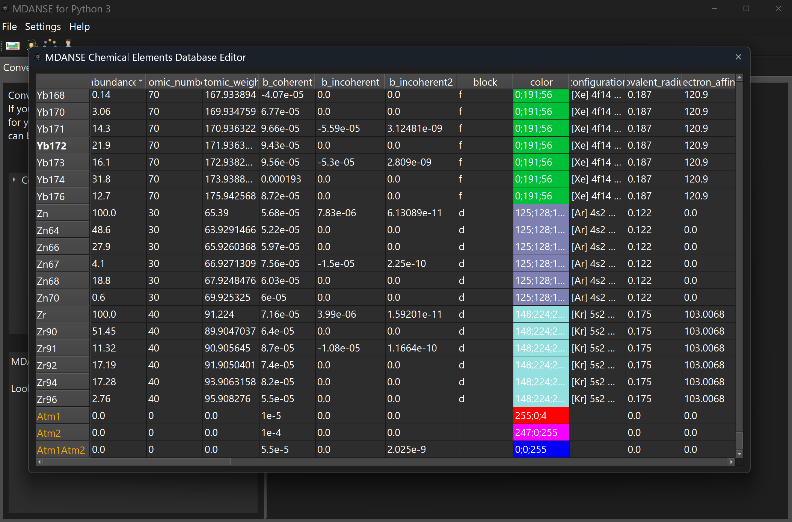
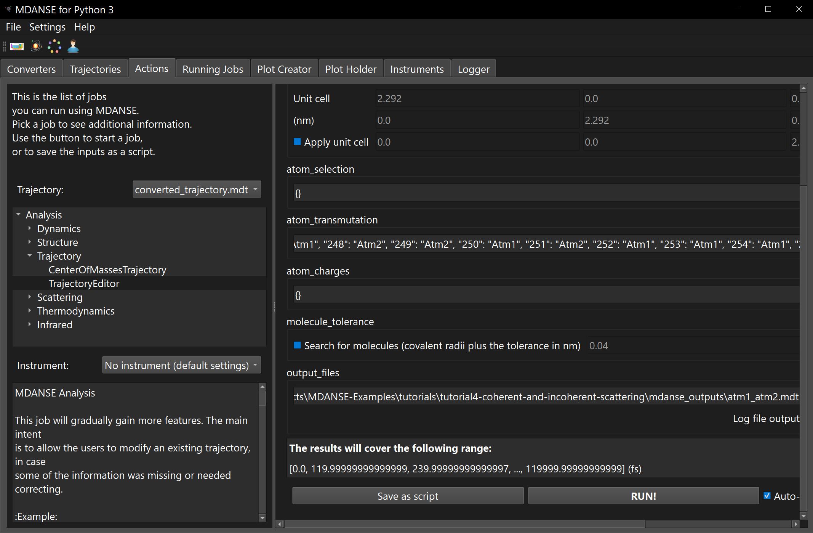
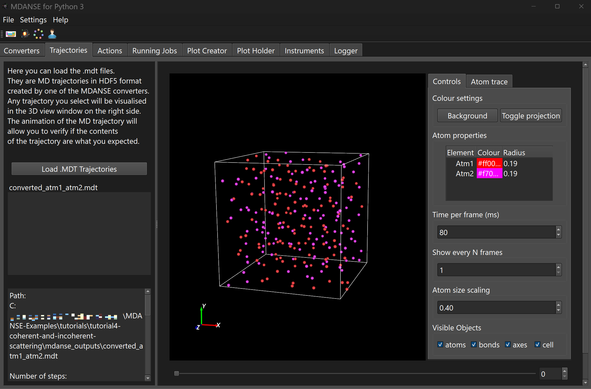
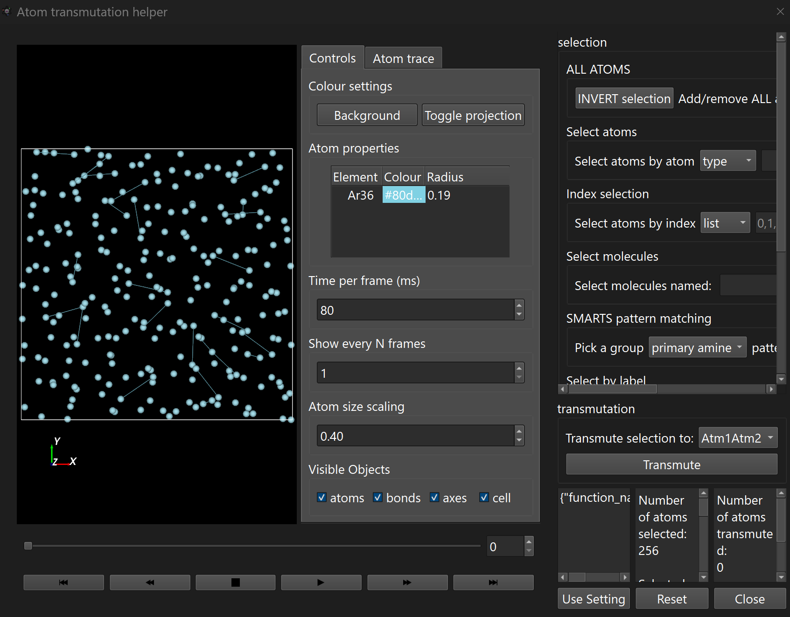
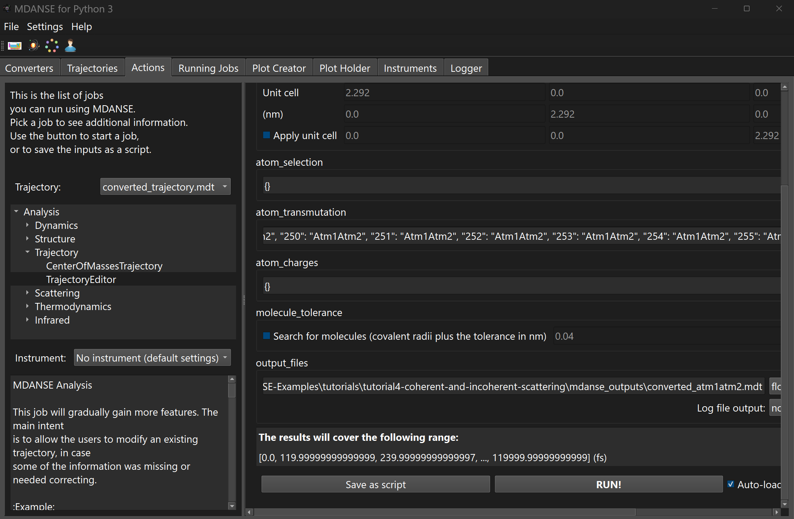
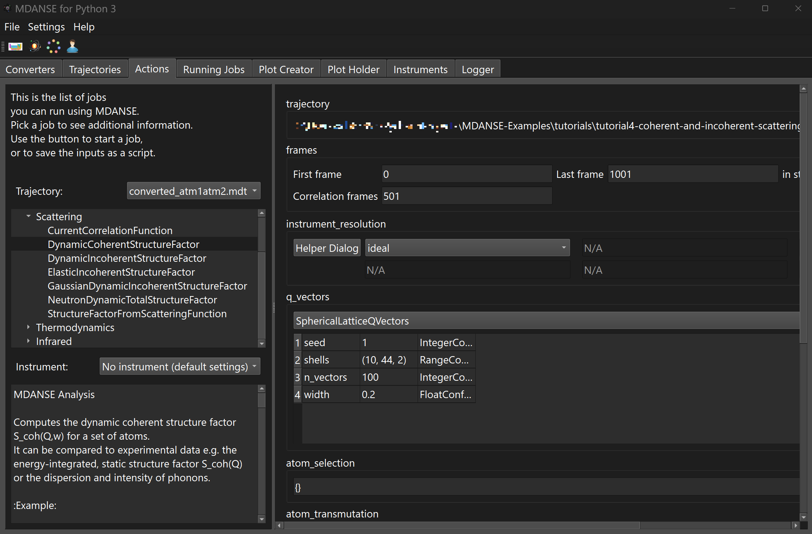
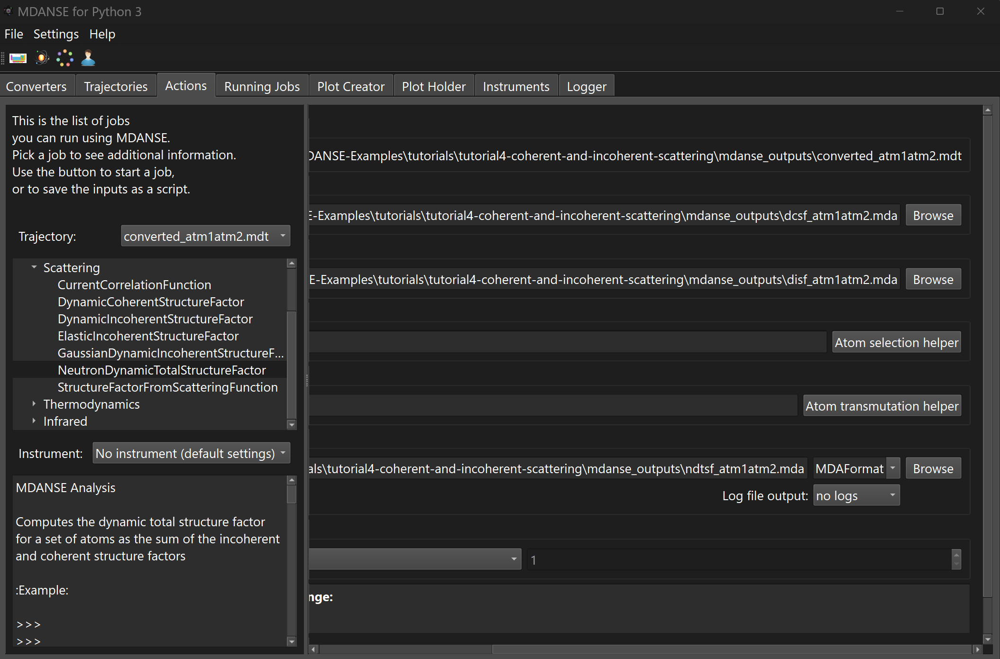
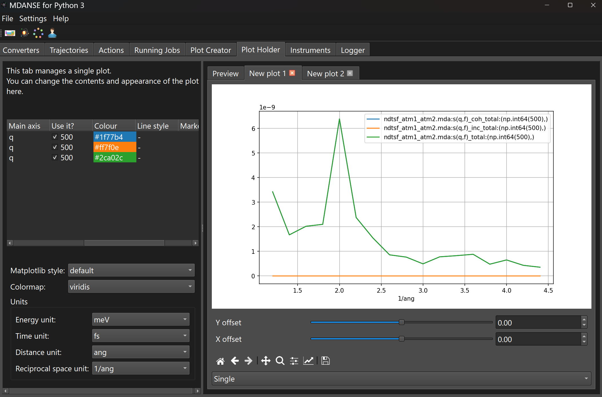
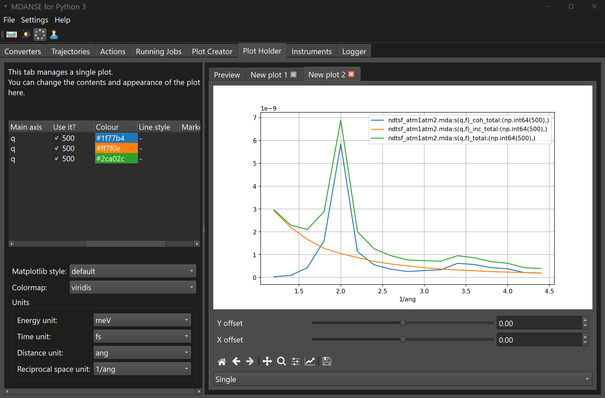
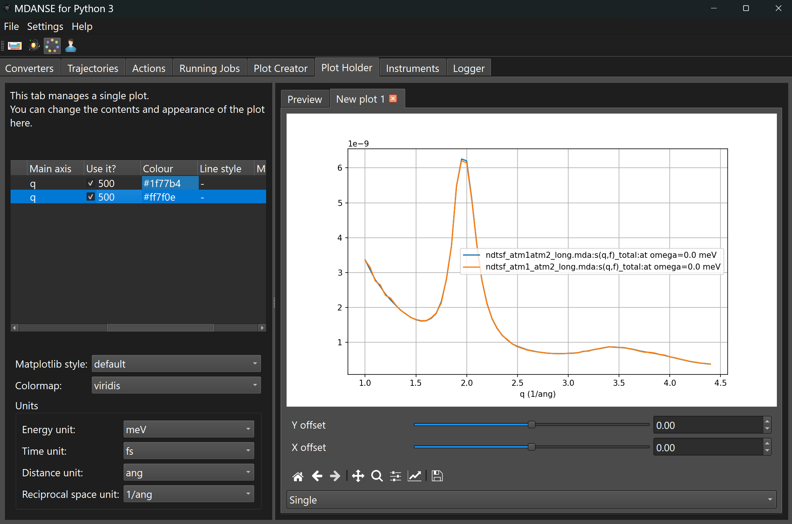

# MDANSE Tutorial 4: Coherent and Incoherent Scattering

This tutorial will show you:
* how to run an analysis related to the coherent and incoherent scattering,

We recommend completing **MDANSE Tutorial 3: Quasielastic neutron 
scattering (QENS)** before starting this one.

## Background

### Spin Incoherence

In MDANSE, the separation into the coherent and incoherent parts of the 
neutron scattering functions is calculated based on the values of `b_coherent`
and `b_incoherent2` (neutron scattering lengths) of the atoms in the
simulated system. There are 
four default hydrogen atom types that can be used. 
H1, H2 and H3 are labels for specific hydrogen isotopes: $^{1}$H,
$^{2}$H (deuterium) and $^{3}$H (tritium).
The fourth one, H, is an averaged atom type with scattering lengths which 
depend on the natural abundances of the three isotopes.

| Atom Type | $b_{\mathrm{coh}}$ / nm  | $b_{\mathrm{inc}}^2$ / nm<sup>2</sup> |
|-----------|--------------------------|---------------------------------------|
| H1        | $-3.7406 \times 10^{-5}$ | $6.3878 \times 10^{-8}$               |
| H2        | $6.671 \times 10^{-5}$   | $1.6322 \times 10^{-9}$               |
| H3        | $4.792 \times 10^{-5}$   | $1.0816 \times 10^{-10}$              |
| H         | $-3.739 \times 10^{-5}$  | $6.3869 \times 10^{-8}$               |

For the isotopes H1, H2, and H3, $b_{\mathrm{coh}}$ and $b_{\mathrm{inc}}^2$ depend on 
their $b_{-}$ and $b_{+}$, and $p_{-}$ and $p_{+}$ values, which are the scattering lengths 
and occupation probabilities for the combined neutron-plus-nucleus system with 
spins $I-\frac{1}{2}$ or $I+\frac{1}{2}$. For example, H1 has a spin of $I = \frac{1}{2}$
and combined spin with the neutron of 0 and 1 with degeneracies of 1 and 3. The measured 
scattering lengths are $b_{-,\text{H1}} = -47.5 \times 10^{-5}$ and $b_{+,\text{H1}} = 10.85 \times 10^{-5}$. 
Therefore, the coherent and the squared incoherent scattering lengths will be

```math
b_{\mathrm{coh,H1}} = \frac{1}{4} (-47.5 \times 10^{-5}) + \frac{3}{4} (10.85 \times 10^{-5}) = -3.7406 \times 10^{-5}
```

and

```math
b_{\mathrm{inc,H1}}^2 = \frac{1}{4} (-47.5 \times 10^{-5})^2 + \frac{3}{4} (10.85 \times 10^{-5})^2 - b_{\mathrm{coh,H1}}^2  = 6.3878 \times 10^{-8}.
```

### Isotopic Incoherence

Let's compare the scattering lengths of argon.


| Atom Type | $b_{\mathrm{coh}}$ / nm | $b_{\mathrm{inc}}^2$ / nm<sup>2</sup> |
|-----------|-------------------------|---------------------------------------|
| Ar36      | $24.9 \times 10^{-5}$   | $0.0$                                 |
| Ar38      | $3.5 \times 10^{-5}$    | $0.0$                                 |
| Ar40      | $1.83 \times 10^{-5}$   | $0.0$                                 |
| Ar        | $1.909 \times 10^{-5}$  | $1.7956 \times 10^{-10}$              |

These isotopes are all zero spin nuclei which lead to zero 
$b_{\mathrm{inc}}^2$ values. Unlike for the hydrogen atoms, there will be no
contribution to the incoherent scattering from spin incoherence. The $b_{\mathrm{inc}}^2$ 
for the Ar atom type arises from isotopic incoherence. The natural abundances
of the argon isotopes are 0.337%, 0.063%, and 99.6% for the Ar36, Ar38, and Ar40 
isotopes, respectively. Therefore, the coherent and the squared incoherent scattering
lengths of Ar are 

```math
b_{\mathrm{coh,Ar}} = 0.00337 (24.9 \times 10^{-5}) + 0.00063 (3.5 \times 10^{-5}) + 0.996 (1.83 \times 10^{-5}) = 1.909 \times 10^{-5}
```

and

```math
b_{\mathrm{inc,Ar}}^2 = 0.00337 (24.9 \times 10^{-5})^2 + 0.00063 (3.5 \times 10^{-5})^2 + 0.996 (1.83 \times 10^{-5})^2 - b_{\mathrm{coh,Ar}}^2  = 1.7956 \times 10^{-10}.
```

When we use the Ar atom type in MDANSE, we assume that the isotopes of argon 
in our system are randomly distributed and follow their natural abundances. 
In the case of the atom types which are not specific isotopes 
(e.g. H and Ar) the $b_{\mathrm{inc}}^2$ contains contributions from only spin 
and isotopic incoherence.


### Chemical Incoherence

Incoherent scattering can arise from a system where two or more atom types with 
different scattering lengths share similar trajectories and distributions 
across the system. Incoherent scattering from this source of randomness 
is known as *chemical incoherence* and is dependent on the system. Chemical 
incoherence is included in MDANSE but will turn up in the coherent signal,
(dynamic coherent structure factor) rather than the incoherent (dynamic 
incoherent structure factor).

## Scenario of this tutorial

Using MDANSE, we will create three new atom types, `Atm1`, `Atm2`, and `Atm1Atm2`.
`Atm1Atm2` will be a combined atom type, representing a mixture of Atm1 and Atm2.
We will calculate the dynamic coherent structure factor (DCSF) and dynamic 
incoherent structure factor (DISF) for a 50/50 mixture of `Atm1` and `Atm2` 
and a system of 100% `Atm1Atm2`. We will then combine the DCSF and DISF 
results using the neutron total dynamic structure factor (NTDSF) job.
We will compare the coherent and incoherent signal between the two 
systems.

# Files

This tutorial contains the following files:

## mdanse_inputs
These are the scripts that, when run from the mdanse_inputs
directory, will produce the outputs of the mdanse runs
described in this tutorial.
* script1_conversion.py - produces the MDANSE-format trajectory from the lammps trajectory files in tutorial 2.
* script2_random.py - generates a transmutation setting which randomly transmutes atoms to the Atm1 or Atm2 atom type.
* script3_atm1_atm2.py - transmutes the argon trajectory so that it is formed of Atm1 and Atm2 atom types.
* script4_atm1atm2.py - transmutes the argon trajectory so that it is formed of the Atm1Atm2 atom type.
* script5_disf.py - calculates the DISF of the Atm1+Atm2 and Atm1Atm2 systems.
* script6_dcsf.py - calculates the DCSF of the Atm1+Atm2 and Atm1Atm2 systems.
* script7_ndtsf.py - calculates the NDTSF using the Atm1+Atm2 and Atm1Atm2 DISF and DCSF results.

## mdanse_outputs
All the files created by MDANSE will be written here. We included some 
precalculated results, created using a longer Argon trajectory.
* ndtsf_atm1_atm2_long.mda - the NDTSF results using a longer and larger Atm1+Atm2 system.
* ndtsf_atm1atm2_long.mda - the NDTSF results using a longer and larger Atm1Atm2 system.


# The actual tutorial, step by step.
In the text of the tutorial, we will concentrate on the
MDANSE GUI. However, the conversion and analysis jobs can
be run also without the GUI. The scripts for running all
the parts of the tutorial are provided in `md_inputs/script*`.


## Convert, edit and load the trajectory

This tutorial will use the trajectory files from tutorial 2 
(see **MDANSE Tutorial 2: the van Hove functions** for details). Alternatively, 
use the `mdanse_inputs/script1_conversion.py` script, which will output the converted 
trajectory into `mdanse_outputs/converted_trajectory.mdt`. This 
trajectory will be a trajectory containing Ar36 atom types. For this 
tutorial we will need to create two new trajectories from the argon one.

First, let's create `Atm1`, `Atm2`, and `Atm1Atm2` atom types. Click the MDANSE 
Chemical Elements Database Editor button (next to the periodic table button) 
to start the editor. Right-click on the table, click `New Custom Atom` and 
add three new atoms `Atm1`, `Atm2`, and `Atm1Atm2` (if these custom atoms 
already exist, then delete them before starting this step of the tutorial). 
Next, set the `b_coherent` and `b_incoherent2` properties to the values
given here:

| Atom Type | $b_{\mathrm{coh}}$ / nm | $b_{\mathrm{inc}}^2$ / nm<sup>2</sup> |
|-----------|-------------------------|---------------------------------------|
| Atm1      | $1.0 \times 10^{-5}$    | $0.0$                                 |
| Atm2      | $1.0 \times 10^{-4}$    | $0.0$                                 |
| Atm1Atm2  | $5.5 \times 10^{-5}$    | $2.025 \times 10^{-9}$                |

The element table with the correct values is shown in the screenshot below.

<p align="center">
    
</p>

A new atom is created with colour set to white and radius set to 0.
Change the colour of `Atm1`, `Atm2`, and `Atm1Atm2` so that they are different 
to each other. Finally, set the `vdw_radius` value to `0.188` 
to give the new atoms a non-zero size in the 3D view.

We defined `Atm1Atm2` to be formed from a 50/50 mixture of `Atm1` and `Atm2`
so that 

```math
b_{\mathrm{coh,Atm1Atm2}} = 0.5 (1 \times 10^{-5}) + 0.5 (1 \times 10^{-4}) = 5.5 \times 10^{-5}
```

and

```math
b_{\mathrm{inc,Atm1Atm2}}^2 = 0.5 (1 \times 10^{-5})^2 + 0.5 (1 \times 10^{-4})^2 - b_{\mathrm{coh,Atm1Atm2}}^2  = 2.025 \times 10^{-9}.
```

Run the `mdanse_inputs/script2_random.py`. This will generate a 
transmutation setting string which tells MDANSE to transmute 128 atoms to 
`Atm1` and 128 to `Atm2` randomly. Now load up `converted_trajectory.mdt` 
and go to the TrajectoryEditor job in the Actions tab. Copy the setting 
string into the transmutation setting box and save the trajectory to 
`mdanse_outputs/converted_atm1_atm2.mdt` and run the TrajectoryEditor job.

<p align="center">
    
</p>

Go to the 3D view to view your edited trajectory. It should be the same 
as the original, except that it will be formed of two different atom types.
Check that `Atm1` and `Atm2` are randomly distributed across the unit cell.

<p align="center">
    
</p>

Next, we need to run another trajectory conversion on `converted_trajectory.mdt`
but this time we will transmute all the atoms to `Atm1Atm2`. The easiest way is to use the 
atom transmutation helper. Click the transmutation helper and then select 
`Atm1Atm2` in the transmutation dropdown.

<p align="center">
    
</p>

Next click `Transmute` button then the `Use Setting` button and close 
the helper. You should see that the transmutation setting box has been 
filled up.  

<p align="center">
    
</p>

Save the trajectory to `mdanse_outputs/converted_atm1_atm2.mdt` 
and run the TrajectoryEditor job.

## DISF, DCSF and NDTSF Calculations

Now, run the DISF and DCSF calculations with both the `converted_atm1_atm2.mdt` 
and `converted_atm1atm2.mdt` trajectories using the following setting for
the qvector generation.

<p align="center">
    
</p>

We used `seed=1` to ensure that the qvectors that are generated and selected 
are the same. Run the calculation with the output results 
saved to `mdanse_outputs/disf_atm1atm2.mda`, `mdanse_outputs/dcsf_atm1atm2.mda` 
`mdanse_outputs/disf_atm1_atm2.mda` and `mdanse_outputs/dcsf_atm1_atm2.mda`.

Next run the NeutronDynamicTotalStructureFactor job, this job is run using 
the DCSF and DISF calculations. Ensure that you have the same trajectory 
selected in the dropdown on the left side of the GUI. 

<p align="center">
    
</p>

Run the NDTSF calculations with the outputs results saved to
`mdanse_outputs/ndtsf_atm1atm2.mda` and `mdanse_outputs/ndtsf_atm1_atm2.mda`.

## Plotting the Results
Load up both `ndtsf_atm1atm2.mda` and `ndtsf_atm1_atm2.mda` into the plot 
holder and plot `s(q,f)_coh_total`, `s(q,f)_inc_total`, and `s(q,f)_total`
setting the `Main axis` to `q` and `Use it?` to `500`.
Since the energy values in the results are indexed from 0 to 1000 and
are symmetrical around 0, by setting `Use it?` to `500` we select
a curve in the centre of the data set, corresponding to 0 energy transfer.
Compare the results 
between `ndtsf_atm1atm2.mda` and `ndtsf_atm1_atm2.mda`.

<p align="center">
    
</p>

<p align="center">
    
</p>

First, let's compare the results for the `s(q,f)_total`. They won't be 
exactly the same because we used a small system size and short trajectory, 
but quantitatively they are similar. The `s(q,f)_coh_total` and 
`s(q,f)_inc_total` of `ndtsf_atm1atm2.mda` and `ndtsf_atm1_atm2.mda` 
are quite different. In `mdanse_outputs` you can find NDTSF results calculated from
a larger system (2048 atoms) and a longer MD run (100001 frames
with 501 correlation frames). In this case, the results for the `s(q,f)_total` 
from `ndtsf_atm1atm2_long.mda` and `ndtsf_atm1_atm2_long.mda` are quite 
similar.

<p align="center">
    
</p>

How we interpret the results depends on what we mean by setting atom types to
`Atm1`, `Atm2`, and `Atm1Atm2`. First, remember that we generated both 
trajectories by transmuting a trajectory of pure liquid Argon, so all 
transmuted atoms are equivalent. If `Atm1` and 
`Atm2` are isotopes of the same element, a calculation using these atom
types will not be including any contributions to `s(q,f)_inc_total`
from isotopic incoherence. If `Atm1` 
and `Atm2` are different chemical elements
then a similar line of reasoning follows,
but with chemical incoherence instead of isotopic incoherence.
The way that `b_coherent` and `b_incoherent2`
are defined in `Atm1Atm2` is specifically for trajectories where `Atm1` 
and `Atm2` are in equivalent positions and have a 1:1 ratio. 
When `Atm1Atm2` is used, the contribution from isotopic incoherence is 
separated from `s(q,f)_coh_total` and put into `s(q,f)_inc_total`. 
