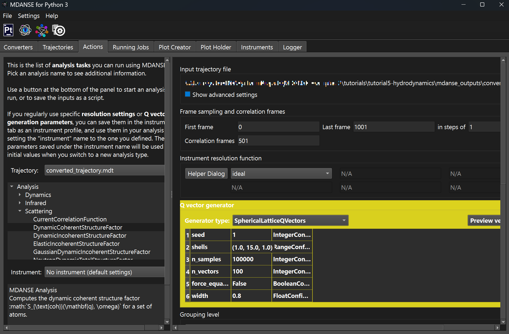
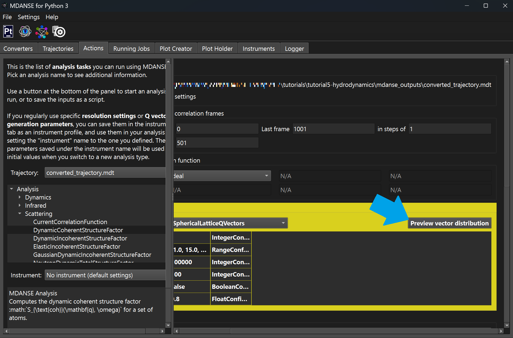
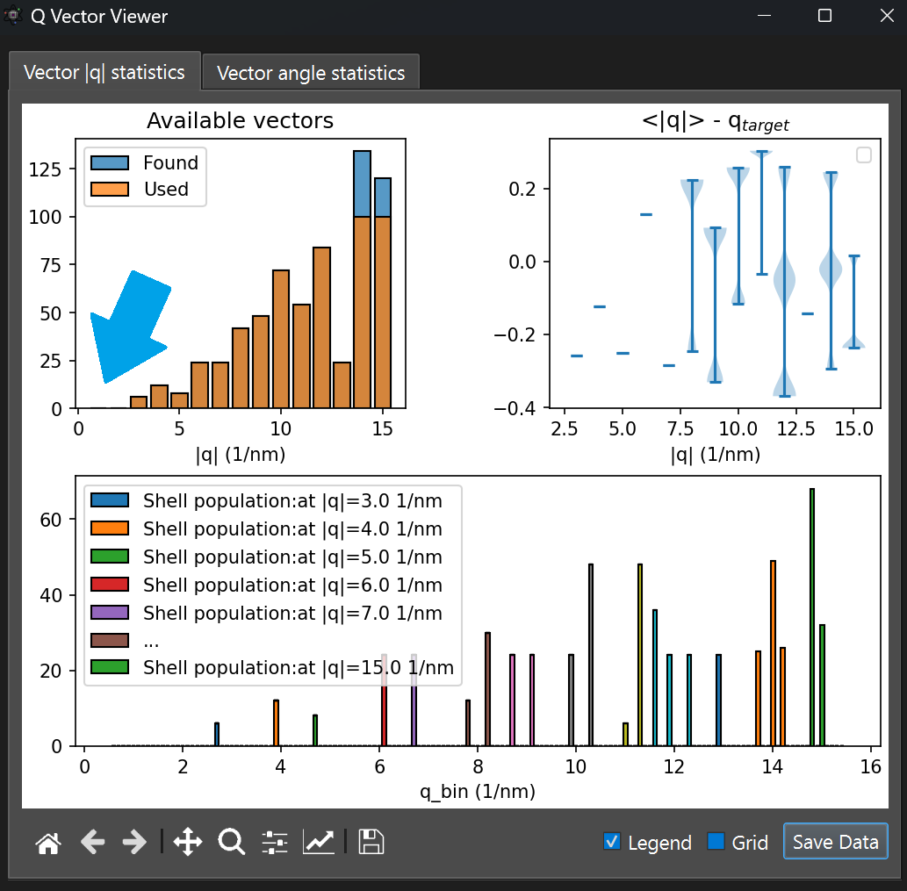
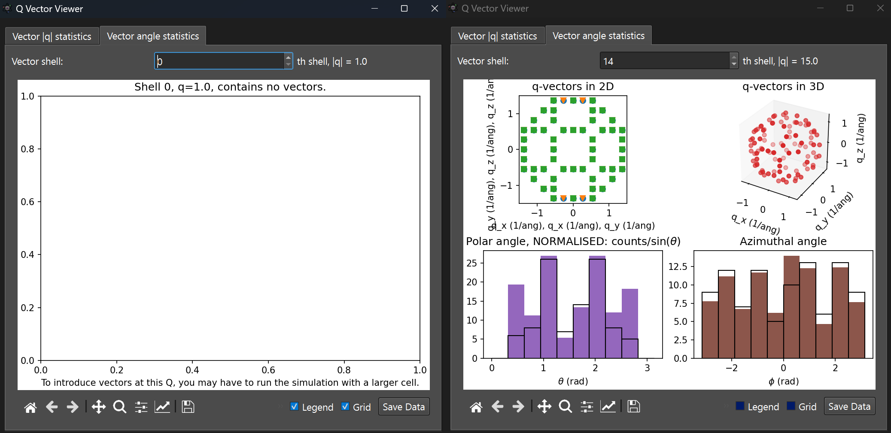
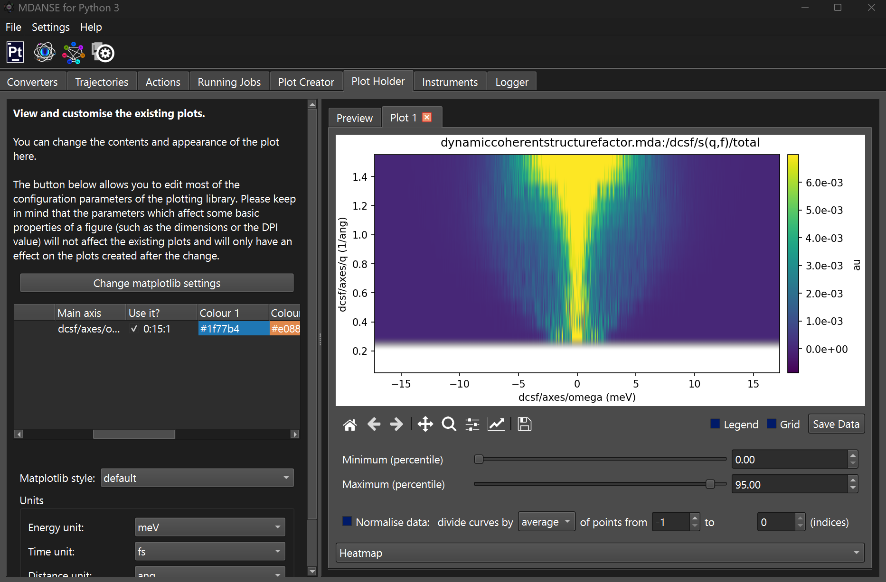
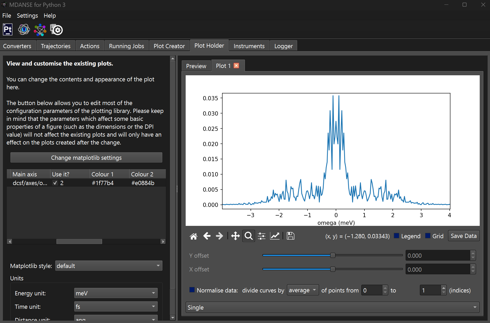

# MDANSE Tutorial 5: Hydrodynamics

This tutorial will show you:
* how to run an analysis related to the coherent scattering

**Questions** will be asked in different sections
of this tutorial. The **answers** will be in `ANSWERS.md`. We recommend completing 
**MDANSE Tutorial 2: the van Hove functions** before starting this one.

## Background
Tutorials 2 to 4, were built from a microscopic theory of the structure and 
dynamics of a simple fluid by describing our system from a sum of particles. 
However, we can instead begin from macroscopic theory of a continuous fluid and derive, for example, 
the scattering function from the correlation function of density 
fluctuations of the fluid. The derivation of a scattering function from the 
hydrodynamic equations and the derivation of the hydrodynamic equations 
themselves are quite involved. We will provide some of the essential idea 
and equations but a more thorough overview can be found elsewhere, see the 
Further reading section.

To build up a macroscopic theory of a fluid we first require an equation
which describes the conservation of some extensive property such as mass.
Consider an element of a fluid with a fixed volume $V$ and surface $S$ in the bulk,
the property (e.g. mass) for this element of fluid is simply
```math
A(t) = \int_{V} \mathrm{d}^3 r\ a(\vec{r}, t)
```
where $a(\vec{r}, t)$ is the local density of this property. The rate 
of change of $A(t)$ over time is
```math
\frac{\mathrm{d} A(t)}{\mathrm{d}t} = - \int_{S} \mathrm{d}\vec{s} \cdot \vec{J}_{a}(\vec{r}, t) + \int_{V} \mathrm{d}^3 r\ \sigma_{a}(\vec{r}, t)
```
where the first integral on the right describes the current flow $\vec{J}_a$ of $a$ into or
out of the volume $V$ through surface element $\mathrm{d}\vec{s}$, and 
$\sigma_a$ is a function which describes 
a change in property $a$ due to some internal sink or source of $a$. From 
Gauss' theorem we can change the above surface integral to a volume integral
so that
```math
\int_{V} \mathrm{d}^3 r\ \left[ \frac{\partial a(\vec{r}, t)}{\partial t} + \vec{\nabla} \cdot \vec{J}_{a}(\vec{r}, t) - \sigma_{a}(\vec{r}, t) \right] = 0
```
and since the volume $V$ was arbitrary 
```math
\frac{\partial a(\vec{r}, t)}{\partial t} + \vec{\nabla} \cdot \vec{J}_{a}(\vec{r}, t) = \sigma_{a}(\vec{r}, t).
```

To obtain the hydrodynamic equations requires the application of the above conservation 
equation to the properties of mass, momentum, and energy where in all cases
$\sigma_{a} = 0$ since there will be no sinks or sources of
mass, momentum, or energy in our system. The conservation equations for mass, 
momentum, and energy are
```math
\frac{\partial \rho}{\partial t} + \vec{\nabla} \cdot \left[ \rho \vec{v} \right] = 0
```
```math
\frac{\partial \rho\vec{v}}{\partial t} + \vec{\nabla} \cdot \left[ \rho \vec{v} \otimes \vec{v} - \overleftrightarrow{\sigma} \right] = 0
```
```math
\frac{\partial e}{\partial t} + \vec{\nabla} \cdot \left[ e \vec{v} + \vec{Q} - \vec{v} \cdot \overleftrightarrow{\sigma} \right] = 0
```
where $\rho$ is the local mass density, $\vec{v}$ is the fluid velocity,
$\overleftrightarrow{\sigma}$ is the stress tensor, $e$ it the local energy density, 
and $\vec{Q}$ is the flux of the heat energy density. The first equation is the
conservation of mass and the flux of the mass density is 
```math
\rho \vec{v}
```
since the flow of mass density across our fluid will be purely due to the 
fluid velocity. The second equation is the conservation of momentum
and the flux of the momentum density is 
```math
 \rho \vec{v} \otimes \vec{v} - \overleftrightarrow{\sigma}
```
where the first and second terms are flux of momentum density due to the 
fluid velocity and the external forces from the bulk onto our element of fluid respectively. 
Finally, the third equation is the conservation of energy and the flux of the 
energy density is
```math
 e \vec{v} + \vec{Q} - \vec{v} \cdot \overleftrightarrow{\sigma}
```
where the first, second, and third terms are the flux of the energy due to the 
fluid velocity, heat diffusion, and external work done by the bulk
onto our element of fluid respectively.

For a compressible Newtonian fluid the stress tensor is as follows 
```math
\overleftrightarrow{\sigma} = - p\overleftrightarrow{I} + \eta_{s} \left[ \vec{\nabla}\otimes \vec{v} +  (\vec{\nabla}\otimes \vec{v})^{\mathrm{T}} - \frac{2}{3} (\vec{\nabla} \cdot \vec{v}) \overleftrightarrow{I}\right] + \eta_{v} (\vec{\nabla} \cdot \vec{v})\overleftrightarrow{I}
```
where $p$ is the pressure density, and $\eta_{s}$ and $\eta_{v}$ are the shear and bulk viscosities, 
see Further reading for more details. The above stress tensor together with the 
equation for momentum conservation lead to the Navier-Stokes equations
for a compressible fluid. The flux of the heat energy density $\vec{Q}$
is given by Fourier's law
```math
\vec{Q} = - \lambda \vec{\nabla} T
```
where $\lambda$ is the materials thermal conductivity, and $\vec{\nabla} T$
is the temperature gradient.

The above hydrodynamic equations can be simplified by linearizing 
since the fluctuations in the density, momentum, energy, and temperature 
are expected to be small. So that we have
```math
\rho = \rho_{0} + \rho_{1}
```
```math
\vec{v} = \vec{v}_{0} + \vec{v}_{1} = \vec{v}_{1}
```
```math
e = e_{0} + e_{1}
```
```math
p = p_0 + p_1
```
```math
T = T_{0} + T_{1}
```
where the terms with subscript $0$ are constants at their equilibrium values. The linearized
hydrodynamic equations are 
```math
\frac{\partial \rho_1}{\partial t} + \rho_{0} \vec{\nabla} \cdot \vec{v} = 0
```
```math
\rho_0 \frac{\partial \vec{v}}{\partial t}  = - \vec{\nabla} p_1 + \eta_{s}\nabla^{2}\vec{v} + \left(\eta_{v} + \frac{1}{3} \eta_{s}\right) \vec{\nabla}(\vec{\nabla} \cdot \vec{v})
```
```math
\frac{\partial e_1}{\partial t} + (e_{0} + p_0) \vec{\nabla} \cdot \vec{v} = \lambda \nabla^2 T_{1}.
```
To obtain a scattering function from the above equation requires the 
correlations functions between specific fluctuation terms, most notably 
the density fluctuation-density fluctuation correlation function. Using the linearlized
hydrodynamics equation an approximation for the scattering function can be 
obtained, see material in Further reading for more details.
```math
S(q, \omega) = \frac{1}{\pi} V \rho k_{\mathrm{B}}T \chi_{T} \left\{ \left(\frac{\gamma - 1}{\gamma} \right)\frac{D_{T} q^2}{\omega^2 + (D_{T} q^2)^2} + \frac{1}{\gamma} \left[ \frac{ \Gamma q^2 }{(\omega + c_{\mathrm{s}} q)^2 + (\Gamma q^2)^2}  + \frac{ \Gamma q^2 }{(\omega - c_{\mathrm{s}} q)^2 + (\Gamma q^2)^2} \right] \right\}
```
Usually there is another term inside the curly braces, but it is usually small
so we have not written it here. In the equation above, $\chi_{T}$ is 
the isothermal compressibility, $\gamma = c_{\mathrm{p}} / c_{\mathrm{V}}$ 
is the specific heat ratio, $D_{T}$ is the thermal diffusivity, 
$\Gamma$ is the classical attenuation coefficient of sound, and $c_{\mathrm{s}}$
is the adiabatic sound speed.

**Question 1**: From the equation for the scattering function above can you 
see what the spectrum should look like for a given non-zero value of 
`q`?

## Scenario of this tutorial
An approximation for $S(\vec{q}, \omega)$ was derived from the hydrodynamic 
equations which is based on a macroscopic theory of liquids. Let's run some 
molecular dynamics simulations to see if/when our numerical simulations based on
a microscopic theory of a liquid agrees with hydrodynamics.

# Files

This tutorial contains the following files:

## mdanse_inputs
These are the scripts that, when run from the mdanse_inputs
directory, will produce the outputs of the mdanse runs
described in this tutorial.
* script1_conversion.py - produces the MDANSE-format trajectory from the lammps trajectory files in tutorial 2.
* script2_dcsf.py - calculates the DCSF of the simulated system.

## mdanse_outputs
All the files created by MDANSE will be written here. We included some 
precalculated results, created using a longer and larger Argon trajectories.

# The actual tutorial, step by step.
In the text of the tutorial, we will concentrate on the
MDANSE GUI. However, the conversion and analysis jobs can
be run also without the GUI. The scripts for running all
the parts of the tutorial are provided in `md_inputs/script*`.

## Convert and load the trajectory
This tutorial will use by using the trajectory files from tutorial 2, 
see **MDANSE Tutorial 2: the van Hove functions** for details. Alternatively 
use the `mdanse_inputs/script1_conversion.py` script, the converted 
trajectory will be in `mdanse_outputs/converted_trajectory.mdt`.

## Calculate the DCSF
Load the `converted_trajectory.mdt` from tutorial 2 in the GUI and select the 
DynamicCoherentStructureFactor job from the actions tab and set the q-vector
generations settings following the screenshot below.

<p align="center">
    
</p>

Notice that the q-vector generations settings widget has a yellow highlighting
this means that the job can be run but there could be some issues in the 
calculations. You can hover your mouse over the highlighted widget to see the warning message from MDANSE. 
Let's have a look at the q-vectors in detail by opening the Preview vector distribution.

<p align="center">
    
</p>

This will open a new widget containing some statistics for the generated q-vectors.

<p align="center">
    
</p>

Notice that there are no vectors for the smaller q-vectors we were
trying to generate. This is because the SphericalLatticeQVector generator can
only select reciprocal lattice vectors generated from the unit cell of our 
trajectory. Basically the simulation cell was too small for the shell 
we are trying to generate.

If you move to the Vector angle statistics tab you can see the generated q-vectors
in more detail.

<p align="center">
    
</p>

Have a look at the other shells, as shown in the Vector |q| statistics tab 
the smaller shells have fewer q-vectors. Once you are done run the MDANSE job
and save the output to `mdanse_outputs/dcsf_256.mda`.

## Plotting the Results
Load up the `dcsf_256.mda` into the plot holder
and plot the `s(q,f)/total` result and select `Heatmap` from the dropdown
below the plot.

<p align="center">
    
</p>

Try changing the Minimum and Maximum sliders to changing how the heatmap
is coloured. First notice that for low $q$ the heatmap is not drawn this
is because no q-vectors where generated for those shells. Next notice 
that the results from the heatmap suggests there are more features in the 
scattering function that one singular peak. 

Let's have a look at the scattering function for specific shells. Select
the Single plot type and set "Use it?" to `2`, this is the first shell
which has calculated results. 

<p align="center">
    
</p>

The scattering function is very noisy because the trajectory was both very
small and short. However, we can already see that there is something similar to 
what hydrodynamics suggests. Try having a look at the scattering function for the other shells. 
Clearly we will need both a larger system to be able to obtain results for small $q$ and longer 
trajectory to increase the resolution and reduce the noise in our scattering function.


# Further reading
Boon, J. P., Yip, S. (1991). Molecular Hydrodynamics. Dover Publications.

Berne, B. J., Pecora, R. (2000). Dynamic Light Scattering: With Applications to Chemistry, Biology, and Physics. Dover Publications.

Landau, L. D., Lifshitz, E. M. (1959). Fluid Mechanics. Pergamon Press.
